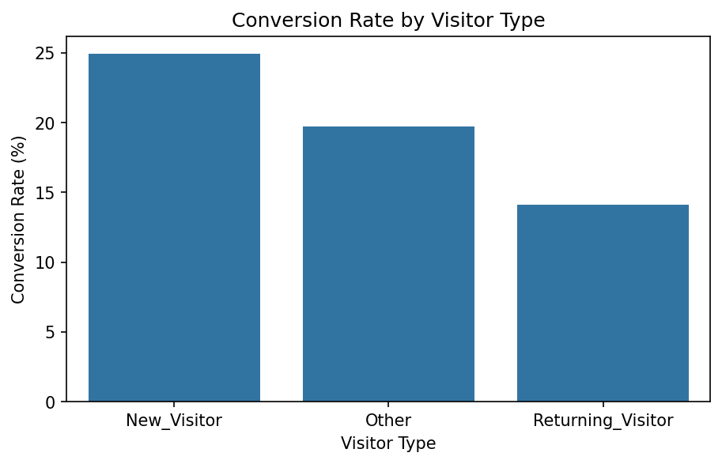
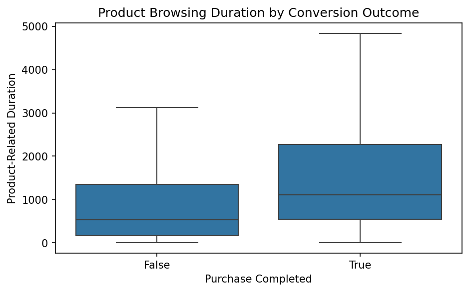
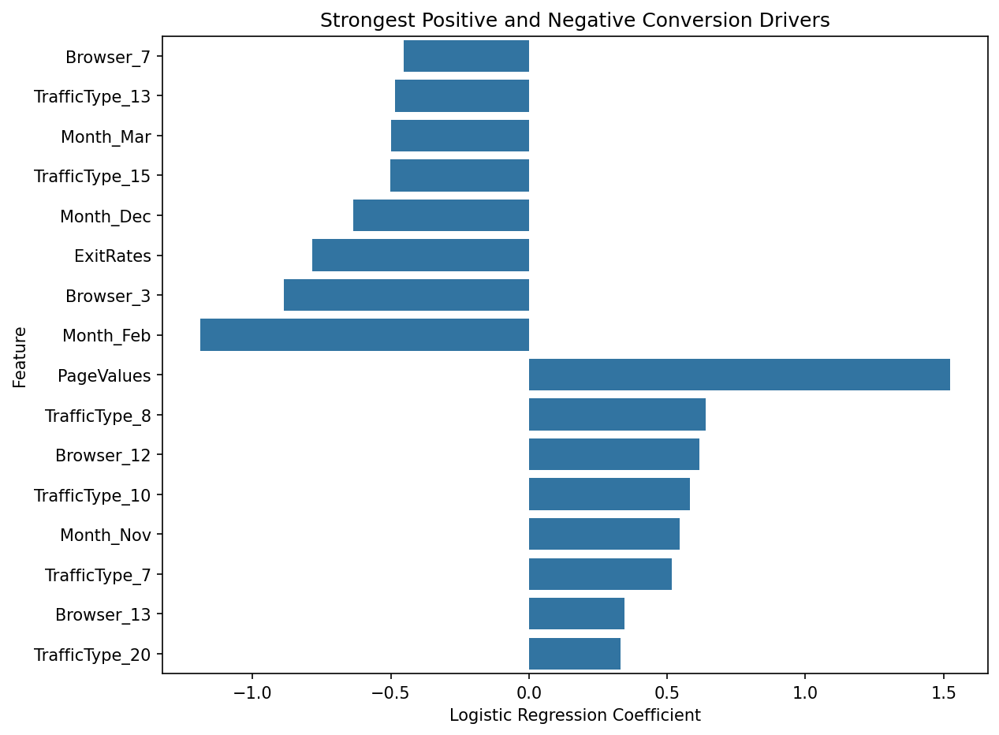

# E-Commerce Conversion Prediction & Behavioral Analysis

An end-to-end customer behavior and purchase conversion analysis using **Python, Pandas, Scikit-learn, Matplotlib, and Seaborn**.

The project analyzes online shopping sessions to understand which user behaviors are associated with purchase conversion and builds an interpretable **Logistic Regression** model to predict whether a session will result in a purchase.

---

## Dataset

**Online Shoppers Purchasing Intention Dataset**

- 12,330 original sessions
- 12,205 unique sessions after removing 125 exact duplicates
- 17 predictor variables
- Target: `Revenue`
  - `1` = Purchase
  - `0` = No Purchase
- Overall conversion rate: **15.63%**

---

## Key Business Insights

- New visitors converted at **24.93%**, compared with **14.09%** for returning visitors.
- Converting sessions viewed a median of **29 product-related pages**, compared with **16** for non-converting sessions.
- Converting sessions spent about **2.1× more time** browsing product-related pages.
- Non-converting sessions had approximately **4.5× higher bounce rates** and **2.3× higher exit rates**.
- November recorded the highest conversion rate at **25.49%**.

### Conversion Rate by Visitor Type



### Product Engagement by Conversion Outcome



---

## Modeling Approach

The modeling pipeline included:

- One-hot encoding for categorical variables
- Stratified 80/20 train-test split
- StandardScaler for numerical features
- Majority-class baseline
- Standard Logistic Regression
- Class-weighted Logistic Regression
- Precision / Recall / F1 / ROC-AUC evaluation
- Threshold analysis
- Feature coefficient interpretation
- `PageValues` sensitivity analysis

---

## Model Results

### Standard Logistic Regression

| Metric | Score |
|---|---:|
| Accuracy | 88.78% |
| Precision | 75.71% |
| Recall | 41.62% |
| F1-score | 53.72% |
| ROC-AUC | 89.97% |

The standard model was highly precise but missed a large number of actual purchasers.

### Balanced Logistic Regression

| Metric | Score |
|---|---:|
| Accuracy | 84.80% |
| Precision | 50.92% |
| Recall | 79.58% |
| F1-score | 62.10% |
| ROC-AUC | 90.96% |

Class weighting substantially improved recall at the cost of lower precision.

---

## Threshold Analysis

A lower decision threshold was tested to improve the precision-recall balance.

| Threshold | Precision | Recall | F1-score |
|---:|---:|---:|---:|
| 0.50 | 75.71% | 41.62% | 53.72% |
| 0.40 | 72.87% | 47.12% | 57.23% |
| **0.30** | **67.88%** | **58.64%** | **62.92%** |
| 0.20 | 53.98% | 72.77% | 61.98% |

Among the tested thresholds, **0.30 produced the highest F1-score** and a more balanced trade-off between precision and recall.

---

## Key Conversion Drivers

`PageValues` was the strongest positive predictor, while higher `ExitRates` were strongly associated with lower purchase likelihood.



For standardized numerical features:

- A one-standard-deviation increase in `PageValues` was associated with approximately **4.6× higher purchase odds**.
- A one-standard-deviation increase in `ExitRates` was associated with approximately **54% lower purchase odds**.

These are associations and should not be interpreted as causal effects.

---

## PageValues Sensitivity Check

Because `PageValues` was much stronger than the other predictors, the balanced model was retrained without it.

ROC-AUC dropped from approximately:

**0.91 → 0.76**

and F1-score dropped from:

**0.62 → 0.41**

This showed that `PageValues` contributes a substantial share of the model's predictive power, although the remaining behavioral features still contain useful signal.

---

## Business Recommendations

- Use lower prediction thresholds for **low-cost interventions** such as recommendations, reminders, or remarketing where higher recall is valuable.
- Investigate **high-engagement non-converters** for possible checkout friction, pricing concerns, trust issues, or product availability.
- Analyze pages with high exit behavior and test improvements to navigation, product information, and checkout flow.
- Use seasonal conversion patterns to guide campaign timing, while validating the pattern on additional time periods.

---

## Project Structure

```text
ecommerce-conversion-prediction/
│
├── data/
│   └── online_shoppers_intention.csv
│
├── notebooks/
│   ├── 01_data_exploration.ipynb
│   └── 02_conversion_model.ipynb
│
├── images/
│   ├── visitor_conversion.png
│   ├── product_engagement.png
│   └── conversion_drivers.png
│
└── README.md
